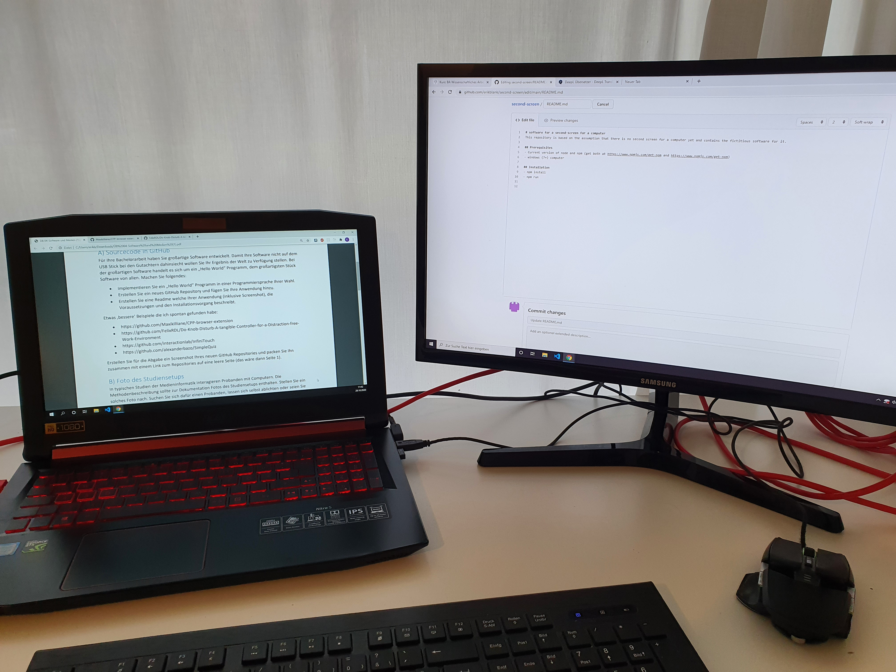

# software for a second-screen for a computer
This repository is based on the assumption that there is no second screen for a computer yet and contains the fictitious software for it.

## Prerequisites 
- Current version of node and npm (get both at https://www.npmjs.com/get-npm and https://www.npmjs.com/get-npm)
- windows (7+) computer

## Installation
- npm install
- npm run
